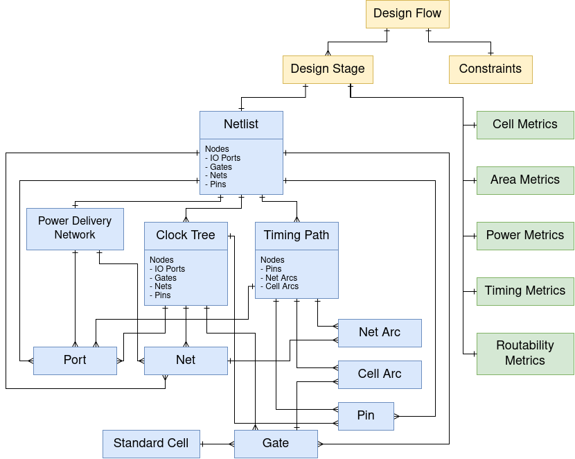

# EDA-Schema: A Multimodal Datamodel for Digital Circuit Design

[](LICENCE)
[](https://www.python.org/downloads/)

EDA-Schema is an open, standardized, and extensible **multimodal datamodel and framework** for representing, storing, and analyzing digital circuit physical design data across the RTL to GDSII flow. It models circuits using **heterogeneous graphs**, **spatial image modalities**, **scalar heatmaps**, and **structured metric entities**, providing unified representations of circuit structure, electrical behavior, quality-of-results metrics, and stage-wise design evolution for reproducible analysis and machine learning research in electronic design automation.

## Key Features

- **Unified Multimodal Datamodel**
  - Heterogeneous graph representations of circuit structure
  - Spatial image representations of placement and routing
  - Scalar heatmaps for IR drop, electromagnetic radiation, and routability
  - Structured QoR metric entities

- **High Performance ParquetDB Backend**
  - Optimized columnar storage on Apache Parquet
  - Predicate pushdown
  - Parallel processing for large scale EDA datasets

- **Large Scale Open Dataset**
  - 18 benchmark circuits: 16 from the IWLS'05 suite, 1 from OpenCores, and 1 from IBEX
  - 4 open source PDKs
  - 7,800+ design instances
  - Stage resolved multimodal snapshots across the OpenROAD flow

- **Research Ready**
  - Query APIs
  - Visualization tooling
  - Benchmark tasks for timing, power, area, and routability prediction
  - Extensible ML ready schema

## Table of Contents

- [Data Model Overview](#data-model-overview)
- [Open Dataset](#open-dataset)
- [Installation](#installation)
- [Quick Start](#quick-start)
- [Testing & Development](#testing--development)
- [Citation](#citation)
- [Support & Contact](#support--contact)

---

## Data Model Overview

### Schema Architecture

EDA-Schema is a **multimodal datamodel schema** for representing digital circuits throughout the RTL to GDSII physical design flow. At each design stage, structural netlists, timing reports, parasitic extraction, physical layout information, power delivery analysis, and QoR metrics are extracted and organized into a unified schema. As the design progresses, the representation becomes increasingly complete, physically accurate, and analytically rich.

Each circuit is represented using multiple complementary modalities:

- **Graph representations**
  - Netlist
  - Clock Network
  - Timing Path

- **Spatial image representations**
  - Cell placement maps
  - Pin placement maps
  - Routing maps
  - Metal layer routing maps
  - Clock routing maps
  - PDN routing maps

- **Scalar spatial maps**
  - IR drop heatmaps
  - Electromigration heatmaps
  - Routability (RUDY) maps

- **Structured metric entities**
  - Cell Metrics
  - Area Metrics
  - Power Metrics
  - Timing Metrics
  - Routability Metrics

Together, these modalities provide a complete representation of digital circuit structure, implementation, and performance.

### Primary Entities

| Entity | Description |
|---|---|
| **Netlist** | Primary heterogeneous graph representing gates, pins, nets, and I/O ports together with placement and routing modalities |
| **Clock Network** | Netlist subgraph modeling clock propagation, clock routing, and sequential sinks |
| **Timing Path** | Directed timing graph extracted from STA representing signal propagation through cell arcs and net arcs |
| **Power Delivery Network** | Spatial representation of VDD/VSS routing, power sources, IR drop, and electromigration analysis |
| **Quality Metrics** | Structured and spatial QoR entities capturing area, power, timing, and routability |

### Supporting Entities

| Category | Entities |
|---|---|
| **Design Flow** | DesignFlow, DesignStage, DesignConstraint |
| **Circuit Elements** | Gate, Net, Pin, Port |
| **Library Characterization** | StandardCell |
| **Timing Components** | TimingPath, CellArc, NetArc |
| **QoR Metrics** | CellMetrics, AreaMetrics, PowerMetrics, TimingMetrics, RoutabilityMetrics |

### Design Stages Captured

- `floorplan`
- `global_place`
- `place_resize`
- `detailed_place`
- `cts`
- `global_route`
- `detailed_route`
- `final`



---

## Open Dataset

EDA-Schema provides a large scale open and reproducible dataset of digital physical designs generated using open source tools, public benchmark circuits, and multiple open source PDKs.

### Dataset Specifications

**Benchmark Suite**
- 16 IWLS'05 benchmark circuits
- 1 OpenCore circuit
- 1 Ibex Core

**Physical Design Toolchain**
- OpenROAD

**PDKs**
- Nangate 45 nm
- SkyWater 130 nm
- ASAP 7 nm
- IHP SG13G2 130 nm


**Captured Modalities**
- Netlist graphs
- Clock network graphs
- Timing path graphs
- Placement maps
- Routing maps
- PDN maps
- IR drop heatmaps
- Electromigration heatmaps
- RUDY congestion maps
- QoR metric entities

### Timing Operating Points

Designs are generated around standardized timing operating regions:

- **Barely Pass (BP)**: SCPR ∈ (0%, +10%)
- **Barely Fail (BF)**: SCPR ∈ (−10%, 0%)

Baseline operating points are identified per circuit across all PDKs and serve as anchors for dataset generation.

### Dataset Expansion

To increase diversity and capture realistic design trade-offs, the dataset is expanded using parameter sweeps:

- **Target clock periods**: `{0.8 × BF, BF, BP, 1.2 × BP}`
- **Aspect ratio**: `{0.5, 1.0, 1.5}`
- **Core utilization**: PDK dependent ranges
- **Placement density**: `{uniform, 1.25× uniform, 1.5× uniform}`

These sweeps generate both timing clean and timing violating implementations across multiple physical design operating regions.

### Dataset Scale

The resulting released dataset contains:

- **7,800+ design instances**
- **18 benchmark circuits**
- **4 open source PDKs**
- **~275 million gates**
- **~75 million nets**
- **>36 million extracted timing paths**

This provides a large scale multimodal benchmark for machine learning research in digital physical design.

### Download

**Dataset**: [Google Drive](https://drive.google.com/drive/folders/1B3rBvbnviBrKw1aLRpv7e1pEXSCy_vLQ?usp=sharing)

---
## Installation

### System Requirements

- Python 3.11+
- 8 GB+ memory recommended for large datasets
- Optional: Graphviz for graph visualization

### Quick Install

```bash
# Clone repository
git clone https://github.com/drexel-ice/eda-schema.git
cd eda-schema

# Create virtual environment
python3 -m venv .venv
source .venv/bin/activate

# Install package
pip install -e .
```

### Optional Dependencies

Install additional development and notebook dependencies:

```bash
pip install -r requirements-dev.txt
```

For graph visualization support:

```bash
pip install pygraphviz
```

### Verify Installation

```bash
python -c "import eda_schema; print('EDA-Schema installed successfully.')"
```

---

## Quick Start

EDA-Schema stores multimodal circuit data in ParquetDB, where each **flow_id** corresponds to a single RTL to GDSII execution. All artifacts generated during that OpenROAD run (netlist, placement, routing, clock network, timing paths, PDN, and QoR metrics) share the same `flow_id`.

Each `flow_id` contains stage resolved snapshots: `floorplan`, `global_place`, `place_resize`, `detailed_place`, `cts`, `global_route`, `detailed_route`, `final`

### Install the package

```bash
# Install the latest published release
pip install eda-schema

# For development, install from source
python3 -m pip install -e .

# Install development extras (linting, docs, notebooks)
python3 -m pip install -e .[dev]
```

### Load Dataset

```python
from eda_schema.dataset import Dataset
from eda_schema.db.parquet import ParquetDB

# Connect to dataset
db = ParquetDB("dataset/test")
dataset = Dataset(db)

# Load metadata
dataset.load()

print(f"Available flows: {len(dataset)}")
```

### Query Netlist Entity

```python
netlist = dataset.db.get_entity(
    "netlists",
    flow_id="gcd-000001",
    stage="cts",
)

print(f"Gates: {netlist.no_of_cells}")
print(f"Nets: {netlist.no_of_nets}")
print(f"Pins: {netlist.no_of_pins}")
print(f"Utilization: {netlist.utilization:.2f}")
```

### Query Timing Metrics

```python
timing = dataset.db.get_table_data(
    "timing_metrics",
    flow_id="gcd-000001",
    stage="detailed_route",
)

print(f"Worst slack: {timing.worst_slack.min():.3f} ns")
print(f"TNS: {timing.total_negative_slack.sum():.3f} ns")
```

### Query Spatial Modalities

```python
routing = dataset.db.get_entity(
    "netlists",
    flow_id="gcd-000001",
    stage="global_route",
)

routing_map = routing.routing
pin_map = routing.pin_placement
cell_map = routing.cell_placement
```

### Explore Further

Additional examples are available in:

- [`examples/`](examples/) → entity loading and querying
- [`research/notebooks/tutorials`](research/notebooks/tutorials) → analysis and visualization workflows
- [`docs/`](docs/) → schema documentation

---

## Testing & Development

Run tests:

```bash
pytest
```

Run specific test suites:

```bash
pytest tests/unit/
pytest tests/integration/
```

Build documentation:

```bash
cd docs
make html
```

---

## Citation

If you use EDA-Schema in your research, please cite:

```bibtex
@inproceedings{shrestha2024edaschema,
  title={EDA-schema: A graph datamodel schema and open dataset for digital design automation},
  author={Shrestha, P. and Aversa, A. and Phatharodom, S. and Savidis, I.},
  booktitle={Proceedings of the ACM Great Lakes Symposium on VLSI (GLSVLSI)},
  pages={1--8},
  year={2024},
  month={Jun.}
}
```

---

## Support & Contact

- **Issues**: https://github.com/drexel-ice/eda-schema/issues
- **Discussions**: https://github.com/drexel-ice/eda-schema/discussions
- **Email**: Pratik Shrestha (ps937@drexel.edu), Alec Aversa (aja367@drexel.edu)
- **Advisor**: Ioannis Savidis (is338@drexel.edu)
