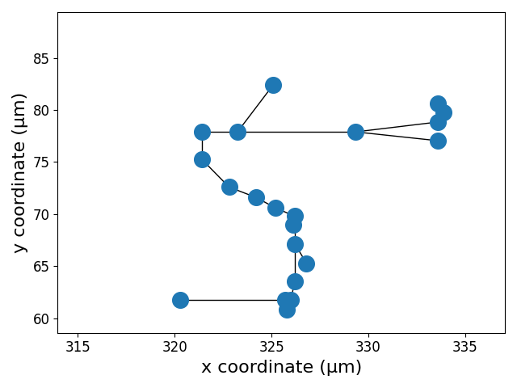
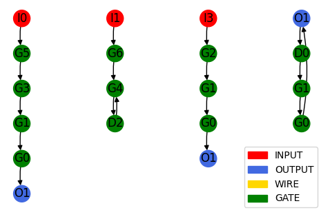

## Graph Datamodel Schema

EDA-schema is a property graph data model schema used to represent digital circuits. Netlists and performance reports are extracted from design tools after each stage of the EDA design flow. These files are utilized to derive structural information and performance metrics for each phase. While post-routing netlists and performance metrics are final and complete, earlier stages still provide incomplete yet useful structural information and estimated performance metrics. The data becomes more complete and accurate as the design flow progresses.

A circuit extracted from the design flow is represented as a graph where nodes are IO pins, gates, and wires, and edges are the connections between them. This primary netlist graph representation is complemented by more granular graph representations, such as a timing path graph and an interconnect graph. Together, these representations complete the schema.

Presented is the entity relationship diagram (ERD) of EDA-schema. The primary graph entities—netlist, clock tree, timing path, and interconnect graphs—are highlighted in gold. Additional tabular entities associated with each graph are shown in silver.  For each circuit, a snapshot of data is available for the following design stages/phases.
- Post floorplan: floorplan
- Post global placement: global_placement
- Post detailed placement: detailed_placement
- Post CTS: cts
- Post global routing: global_route
- Post detailed routing: detailed_route

The primary graph entities of the circuit and schema include:

### Netlist Graph (NG)

- The Netlist graph represents comprehensive structural details of digital circuits.
- **Nodes represent**:
  - Input/output ports (IO): These are the entry and exit points of the circuit for signals.
  - Gates (G): These are logical devices that perform basic operations like AND, OR, NOT, etc.
  - Interconnects (I): These are the wires that connect different components.
- **Edges denote** connections between devices and components.
- Gates (G) extend standard cells (SC) with design-specific structural and spatial attributes, capturing more detailed information about each gate's role and connections in the circuit.

| Feature                      | Data Type | Unit      | Source       |
|------------------------------|-----------|-----------|--------------|
| **Netlist Graph (NG)**       |           |           |              |
| width                        | num       | μm        | DEF file     |
| height                       | num       | μm        | DEF file     |
| no. of inputs                | num       | #         | DEF file     |
| no. of outputs               | num       | #         | DEF file     |
| no. of cells                 | num       | #         | DEF file     |
| no. of nets                  | num       | #         | DEF file     |
| utilization                  | num       | #         | Calculated   |
| pin density                  | num       | μm⁻²      | Calculated   |
| cell density                 | num       | μm⁻²      | Calculated   |
| net density                  | num       | μm⁻²      | Calculated   |
| functionality name           | str       |           |              |
| **Standard Cell (SC)**       |           |           |              |
| width                        | num       | μm        | LEF file     |
| height                       | num       | μm        | LEF file     |
| no. of input pins            | num       | #         | LEF file     |
| no. of output pins           | num       | #         | LEF file     |
| input capacitance (min, max, avg) | num  | pF        | Liberty file |
| output capacitance (min, max, avg) | num | pF        | Liberty file |
| leakage power (min, max, provided) | num | nW        | Liberty file |
| is inverter gate             | boolean   |           | Calculated   |
| is buffer gate               | boolean   |           | Calculated   |
| is sequential gate           | boolean   |           | Calculated   |
| drive strength               | num       |           | Calculated   |
| **Gate (G)**                 |           |           |              |
| name                         | str       |           | DEF file     |
| standard cell                | str       |           | DEF file     |
| no. of fan-ins               | num       | #         | DEF file     |
| no. of fan-outs              | num       | #         | DEF file     |
| gate co-ordinates            | (num, num) | (μm, μm) | DEF file     |
| **IO Port (IO)**             |           |           |              |
| name                         | str       |           | DEF file     |
| direction                    | str       |           | DEF file     |
| co-ordinate                  | (num, num) | (μm, μm) | DEF file     |
| capacitance                  | num       | fF        | DEF file     |

### Quality Metrics

Quality Metrics are extracted from QoR reports to evaluate the performance and efficiency of the design.

| Feature                       | Data Type | Unit      | Source       |
|-------------------------------|-----------|-----------|--------------|
| **Cell Metrics (CM)**         |           |           |              |
| no. of combinational cell     | num       | #         | QoR reports  |
| no. of sequential cell        | num       | #         | QoR reports  |
| no. of buffer cell            | num       | #         | QoR reports  |
| no. of inverter cell          | num       | #         | QoR reports  |
| no. of macros                 | num       | #         | QoR reports  |
| no. of total cell             | num       | #         | QoR reports  |
| **Area Metrics (AM)**         |           |           |              |
| combinational cell area       | num       | μm²       | QoR reports  |
| sequential cell area          | num       | μm²       | QoR reports  |
| buffer cell area              | num       | μm²       | QoR reports  |
| inverter cell area            | num       | μm²       | QoR reports  |
| macro area                    | num       | μm²       | QoR reports  |
| cell area                     | num       | μm²       | QoR reports  |
| net area                      | num       | μm²       | QoR reports  |
| total area                    | num       | μm²       | QoR reports  |
| **Power Metrics (PM)**        |           |           |              |
| combinational power           | num       | μW        | QoR reports  |
| sequential power              | num       | μW        | QoR reports  |
| macro power                   | num       | μW        | QoR reports  |
| internal power                | num       | μW        | QoR reports  |
| switching power               | num       | μW        | QoR reports  |
| leakage power                 | num       | μW        | QoR reports  |
| total power                   | num       | μW        | QoR reports  |
| **Critical Path Metric (CPM)**|           |           |              |
| start point                   | str       |           | STA reports  |
| end point                     | str       |           | STA reports  |
| path type                     | str       |           | STA reports  |
| worst arrival time            | num       | ns        | STA reports  |
| worst slack                   | num       | ns        | STA reports  |
| total negative slack          | num       | ns        | STA reports  |
| no. of timing paths           | num       | #         | STA reports  |
| no. of slack violations       | num       | #         | STA reports  |

### Clock Tree Graph (CTG)

Represents the clock distribution network within the circuit, including buffers, inverters, and the connections between them.

- Clock networks are substructures derived from the netlist
  - Follows the same structure
- **Nodes represent**:
  - Input/output ports (IO)
  - Gates (G)
  - Interconnects (I)
- **Edges denote** connections between devices and components

| Feature          | Data Type | Unit | Source   |
|------------------|-----------|------|----------|
| **Clock Tree Graph (CG)** |  |      |          |
| no. of buffers   | num       | #    | DEF file |
| no. of inverters | num       | #    | DEF file |
| no. of sinks     | num       | #    | DEF file |

### Interconnect Graph

Represents the physical layout of the interconnections, including segments of wires and their parasitic impedances.

- Captures spatial layout and connections
  - **Nodes represent** Interconnect Segments (IS)
  - **Edges denote** connections between segments
- Spatial Graph
  - Captures the spatial layout and connections of the circuit

| Feature                          | Data Type            | Unit      | Source     |
|----------------------------------|----------------------|-----------|------------|
| **Interconnect Graph (IG)**      |                      |           |            |
| name                             | str                  |           | DEF file   |
| no. of inputs                    | num                  | #         | DEF file   |
| no. of outputs                   | num                  | #         | DEF file   |
| bounding box co-ordinates        | (num, num, num, num) | (xmin, ymin, xmax, ymax)| DEF file   |
| half perimeter width length      | num                  | μm        | Calculated |
| RUDY                             | num                  |           | Calculated |
| resistance                       | num                  | fΩ        | SPEF file  |
| capacitance                      | num                  | fF        | SPEF file  |
| **Interconnect Segment (IS)**    |                      |           | DEF file   |
| name                             | str                  |           | DEF file   |
| length                           | num                  | μm        | DEF file   |
| start point co-ordinate          | (num, num)           | μm        | DEF file   |
| end point co-ordinate            | (num, num)           | μm        | DEF file   |
| midpoint                         | (num, num)           | μm        | Calculated |
| RUDY                             | num                  |           | Calculated |
| resistance                       | num                  | fΩ        | SPEF file  |
| capacitance                      | num                  | fF        | SPEF file  |

### Timing Path Graph

Represents the critical timing paths in the circuit, capturing the timing constraints and the delays associated with each path.

- Static Timing Analysis (STA) Timing Path
  - Sequence of circuit elements through which a signal travels
- Timing Path Graphs are subgraphs of netlist graphs
  - **Nodes represent** Timing Path Nodes (TPN)
  - **Edges denote** connections between TPNs

| Feature            | Data Type  | Unit | Source      |
|--------------------|------------|------|-------------|
| **Timing Path Graph (TPG)** |   |      |             |
| start point        | str        |      | STA reports |
| end point          | str        |      | STA reports |
| path type          | str        |      | STA reports |
| arrival time       | num        | ns   | STA reports |
| required time      | num        | ns   | STA reports |
| slack              | num        | ns   | STA reports |
| no. of gates       | num        | #    | STA reports |
| is critical path   | boolean    |      | STA reports |
| **Timing Path Node (TPN)** |    |      |             |
| cell delay         | num        | ns   | STA reports |
| arrival time       | num        | ns   | STA reports |
| slew               | num        | ns   | STA reports |
| is rising transition | boolean  |      | STA reports |
| is falling transition | boolean |      | STA reports |
