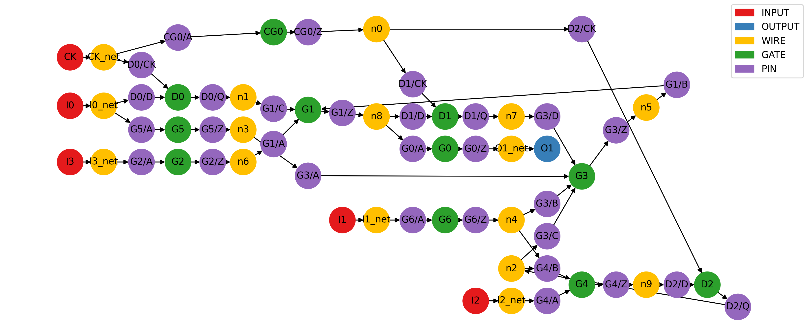
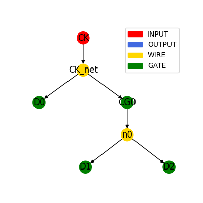
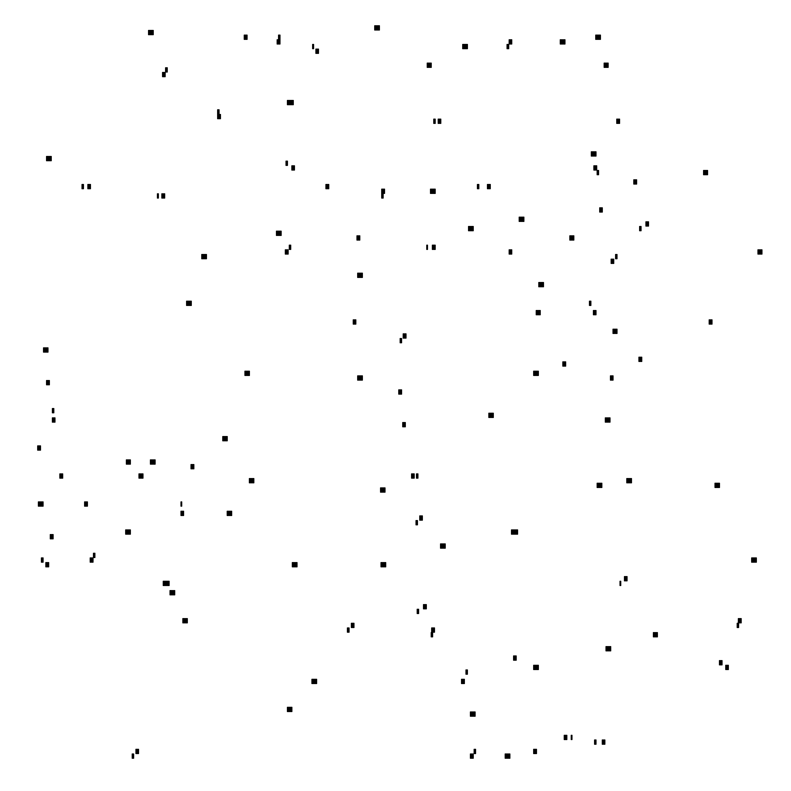
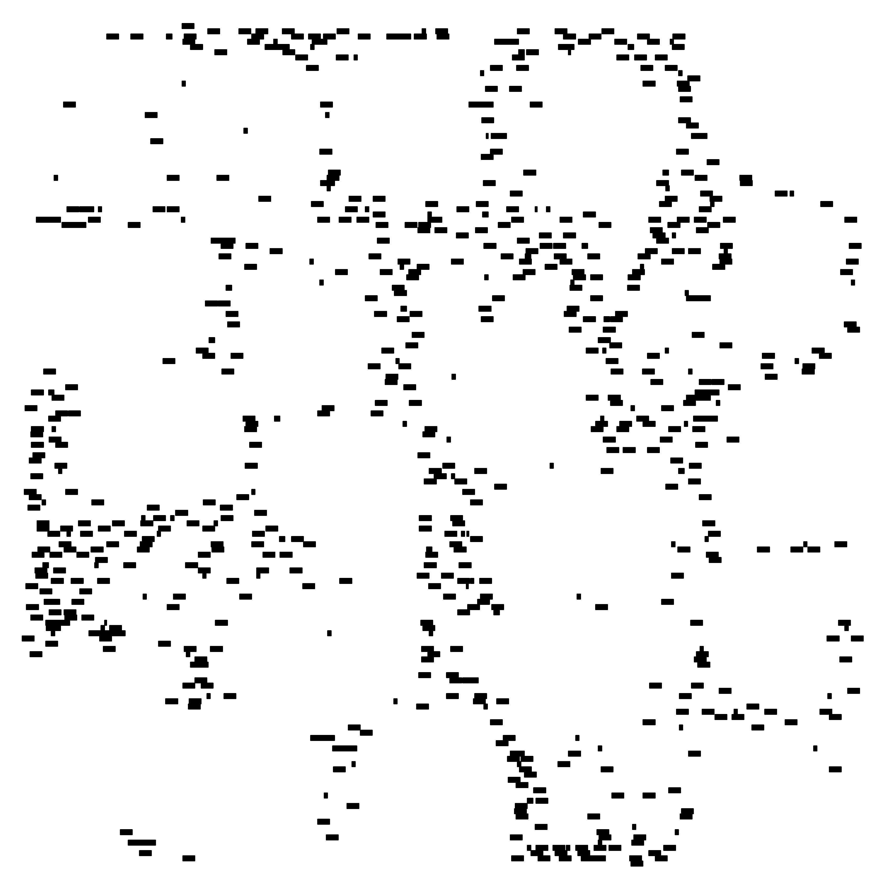
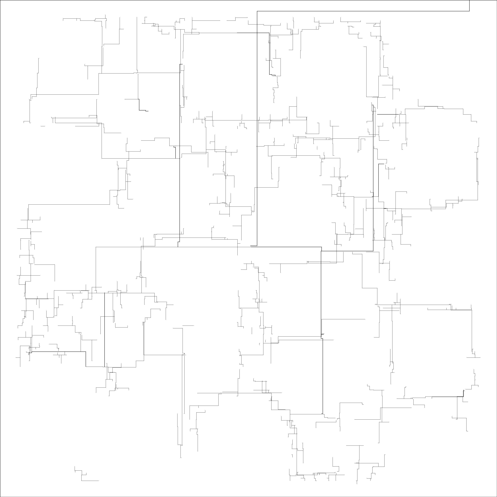
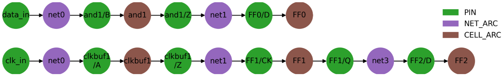
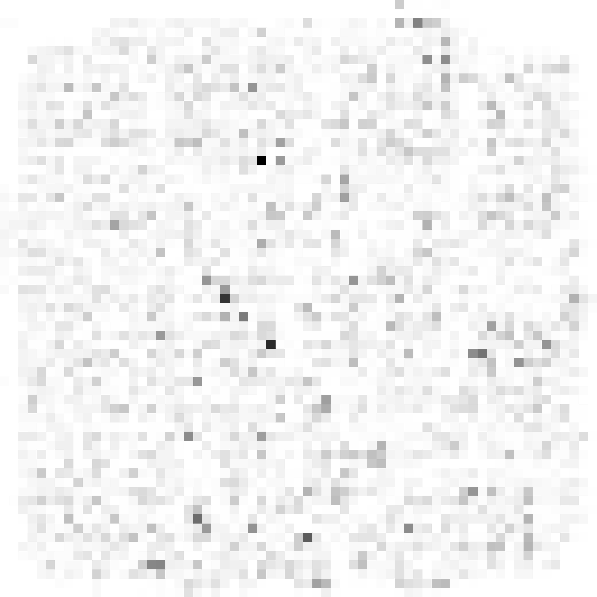
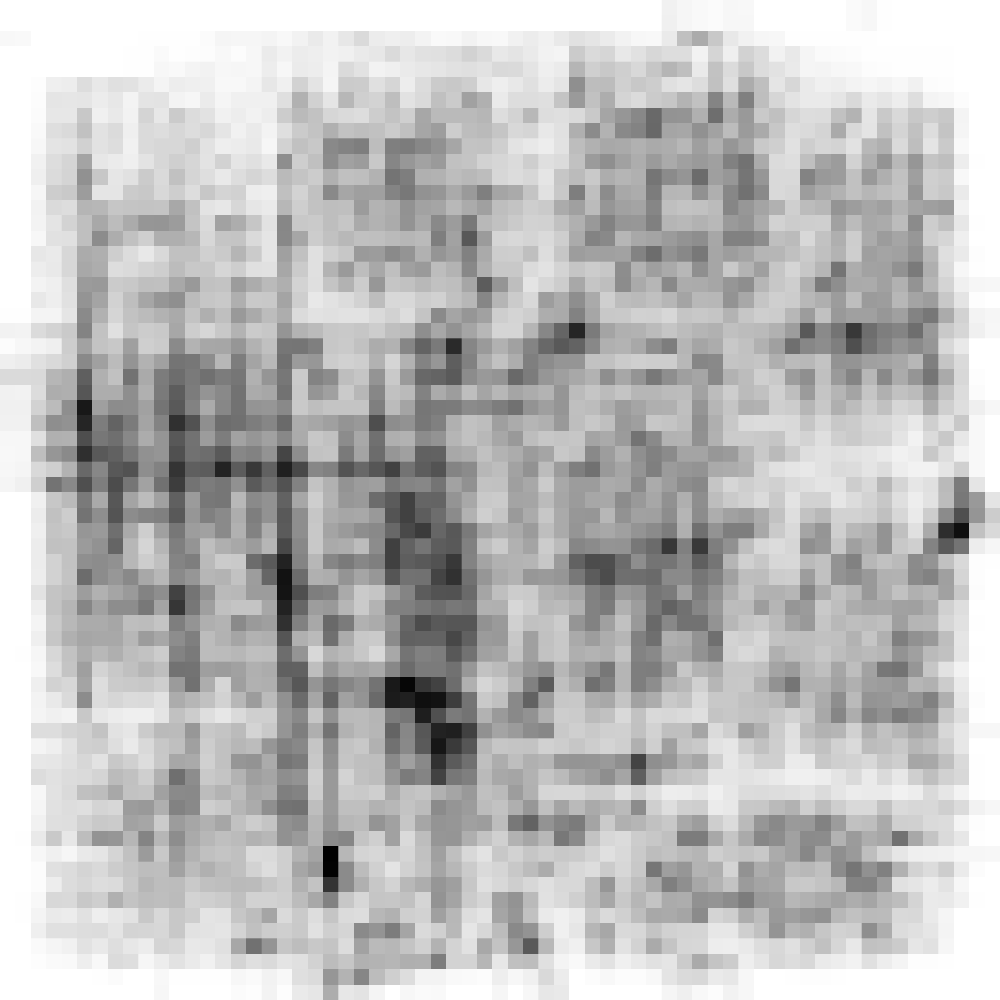
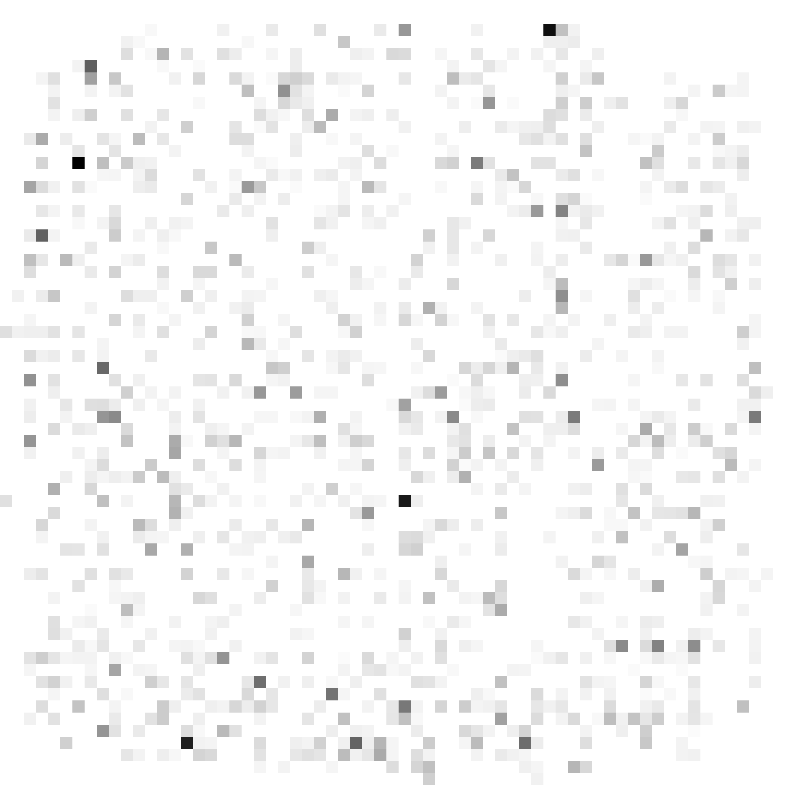

Multimodal Datamodel Schema
===========================

EDA-Schema is a multimodal data schema used to represent digital circuits throughout
the RTL to GDSII physical design flow. Data is extracted from design tools after
each stage of the EDA flow, including structural netlists, physical layout
information, timing reports, parasitic extraction, power delivery analysis, and
quality-of-results metrics.

These artifacts are organized into a unified schema that captures both the
structural composition and performance characteristics of a circuit as it
progresses through the design flow. While later stages provide complete physical
and analytical information, earlier stages still contain partial yet valuable
structural representations and estimated performance metrics. The representation
becomes progressively richer and more accurate at each stage.

A circuit in EDA-Schema is represented using multiple complementary modalities.
Graph representations capture logical and physical connectivity through
heterogeneous netlist graphs, clock network graphs, and timing path graphs.
Spatial image representations capture placement, routing, clock tree structure,
and power delivery networks as binary layout maps. Scalar spatial maps capture
analyzed circuit features such as IR drop, electromigration, and routability
congestion heatmaps.

Presented is the entity relationship diagram (ERD) of EDA-Schema.

For each circuit, stage resolved snapshots are available for the following design
phases:

* Post floorplan: ``floorplan``
* Post global placement: ``global_place``
* Post placement resize: ``place_resized``
* Post detailed placement: ``detailed_place``
* Post clock tree synthesis: ``cts``
* Post global routing: ``global_route``
* Post detailed routing: ``detailed_route``
* Final design stage: ``final``

.. image:: images/schema.png
   :alt: Schema Diagram
   :align: center

The primary graph entities of the circuit and schema include:

Netlist
-------

The **Netlist** entity represents the complete logical and physical composition
of a digital circuit and serves as the primary structural representation.
It is modeled as a heterogeneous graph where nodes correspond to
circuit components and edges capture logical and physical connectivity.

Nodes represent:

* **Input/output ports (IO)**: External circuit interfaces that define signal
  entry and exit points.
* **Gates (G)**: Placed instances of standard cells that implement circuit
  functionality.
* **Pins (P)**: Input and output terminals of gates that define connection and
  timing endpoints.
* **Nets (N)**: Electrical interconnections that connect ports and gate pins.

Edges denote:

* Logical connectivity between ports, gates, pins, and nets.
* Physical connectivity established through placement and routing.

Gate entities extend **Standard Cell** library definitions with design specific
attributes such as placement coordinates, power characteristics, timing
information, and physical layout properties.

Net entities capture both logical wiring relationships and physical interconnect
characteristics, including routing geometry, resistance, capacitance, and
parasitic coupling.

In addition to its graph representation, the Netlist entity includes spatial
image representations that model:

* Combinational cell placement

  .. image:: images/cell_placement_combinational.png
     :width: 192px

* Sequential cell placement

  .. image:: images/cell_placement_sequential.png
     :width: 192px

* Filler cell placement

  .. image:: images/cell_placement_fill.png
     :width: 192px

* Pin placement

  .. image:: images/pin_placement.png
     :width: 192px

* Routing layout

  .. image:: images/routing.png
     :width: 192px

* Routing by individual metal layers

  * Metal layer 1

    .. image:: images/routing_m1.png
       :width: 192px

  * Metal layer 5

    .. image:: images/routing_m5.png
       :width: 192px

Together, these graph and image modalities provide a unified representation of circuit structure, physical implementation, and layout topology.

.. list-table::
   :header-rows: 1

   * - Entity
     - Feature
     - Data Type
     - Unit
     - Source
   * - Netlist
     - width
     - num
     - μm
     - DEF file
   * -
     - height
     - num
     - μm
     - DEF file
   * -
     - no_of_inputs
     - num
     - #
     - DEF file
   * -
     - no_of_outputs
     - num
     - #
     - DEF file
   * -
     - no_of_cells
     - num
     - #
     - DEF file
   * -
     - no_of_nets
     - num
     - #
     - DEF file
   * -
     - no_of_pins
     - num
     - #
     - DEF file
   * -
     - utilization
     - num
     - ratio
     - Calculated
   * -
     - total_wirelength
     - num
     - μm
     - DEF / Routed DEF
   * -
     - total_hpwl
     - num
     - μm
     - Calculated

Power Delivery Network
----------------------

The **Power Delivery Network (PDN)** entity represents the physical and
electrical network responsible for distributing power throughout the circuit.

Physical power network representation:

* Captures dedicated **VDD routing**
* Captures dedicated **VSS routing**
* Models **power source locations**

Electrical analysis representation:

* **IR drop maps** represent localized voltage drop across the layout
* **Electromigration maps** represent current density related reliability stress
* Spatial heatmaps enable localized power integrity analysis

Images:

* VSS routing

  .. image:: images/pdn_vss.png
     :width: 192px

* VDD routing

  .. image:: images/pdn_vdd.png
     :width: 192px

* Voltage source locations

  .. image:: images/pdn_power_source.png
     :width: 192px

* IR drop heatmap

  .. image:: images/ir_drop.png
     :width: 192px

* Electromigration heatmap

  .. image:: images/em.png
     :width: 192px

.. list-table::
   :header-rows: 1

   * - Entity
     - Feature
     - Data Type
     - Unit
     - Source
   * - PDN
     - pdn_routing_vdd
     - binary map
     - spatial
     - DEF / Generated
   * -
     - pdn_routing_vss
     - binary map
     - spatial
     - DEF / Generated
   * -
     - voltage_source
     - binary map
     - spatial
     - PDNSim / Generated
   * -
     - ir_drop_vdd
     - scalar map
     - mV
     - PDNSim
   * -
     - ir_drop_vss
     - scalar map
     - mV
     - PDNSim
   * -
     - em_vdd
     - scalar map
     - current density
     - PDNSim
   * -
     - em_vss
     - scalar map
     - current density
     - PDNSim

Clock Network
-------------

The **Clock Network** entity represents the clock distribution structure within
a circuit, modeling how the clock signal propagates from its source to
sequential elements throughout the design. It is derived as a subgraph of the
Netlist and captures both the logical connectivity and physical implementation
of the clock tree after clock tree synthesis and routing.

Clock Network characteristics:

* **Clock Network is a substructure of the Netlist**
  
  * Follows the same heterogeneous graph representation
  * Captures the dedicated clock propagation network

Nodes represent:

* **Input/output ports (IO):** Clock source ports and external clock interfaces
* **Gates (G):** Clock buffers, inverters, and sequential sink cells
* **Pins (P):** Input and output terminals involved in clock propagation
* **Nets (N):** Clock routing interconnections between clock elements

Edges denote:

* Logical clock connectivity
* Physical routed connections of the clock tree

In addition to its graph representation, the Clock Network includes spatial
image representations of:

Clock buffer placement

Sequential cell placement

Clock routing layout

* Routing by metal layers

These multimodal representations enable structural, spatial, and routing
analysis of clock distribution networks.

.. list-table::
   :header-rows: 1

   * - Entity
     - Feature
     - Data Type
     - Unit
     - Source
   * - Clock Network
     - clock_source
     - str
     -
     - DEF / Clock definition
   * -
     - no_of_buffers
     - num
     - #
     - DEF file
   * -
     - no_of_clock_sinks
     - num
     - #
     - DEF file
   * -
     - cell_placement
     - binary map
     - spatial
     - Generated
   * -
     - cell_placement_combinational
     - binary map
     - spatial
     - Generated
   * -
     - cell_placement_sequential
     - binary map
     - spatial
     - Generated
   * -
     - pin_placement
     - binary map
     - spatial
     - Generated
   * -
     - routing
     - binary map
     - spatial
     - DEF / Generated
   * -
     - routing_by_metal_layers
     - list[binary map]
     - spatial
     - DEF / Generated

Timing Path
-----------

The **Timing Path** entity represents signal propagation paths extracted from
Static Timing Analysis (STA), capturing the sequence of circuit elements
traversed by a signal and the timing characteristics accumulated along that
path. Timing Paths are modeled as directed subgraphs derived from the Netlist,
enabling detailed path level timing analysis across the circuit.

Timing Path characteristics:

* **Static Timing Analysis (STA) Timing Path**

  * Represents a signal path from a startpoint to an endpoint
  * Captures propagation through logic cells and interconnect networks
  * Includes both critical and non critical paths

* **Timing Path graphs are subgraphs of the Netlist**

  * Modeled as directed graphs
  * Represent timing propagation relationships between successive path elements

Nodes represent:

* **Pins (P):** Input and output pin endpoints along the path
* **Input/output ports (IO):** External path startpoints or endpoints
* **Cell Arcs (GA):** Propagation through logic gates
* **Net Arcs (NA):** Propagation through routed interconnects

Edges denote:

* Ordered signal propagation from one timing element to the next
* Timing dependencies between successive path components

This representation separates **cell delay propagation** from
**interconnect delay propagation**, allowing timing behavior to be modeled
structurally and electrically.

.. list-table::
   :header-rows: 1

   * - Entity
     - Feature
     - Data Type
     - Unit
     - Source
   * - Timing Path
     - startpoint
     - str
     -
     - STA reports
   * -
     - endpoint
     - str
     -
     - STA reports
   * -
     - path_type
     - str
     -
     - STA reports
   * -
     - arrival_time
     - num
     - ns
     - STA reports
   * -
     - required_time
     - num
     - ns
     - STA reports
   * -
     - slack
     - num
     - ns
     - STA reports
   * -
     - no_of_pins
     - num
     - #
     - STA reports
   * -
     - is_critical_path
     - boolean
     -
     - STA reports
   * - Cell Arc
     - gate
     - ref
     -
     - STA reports
   * -
     - delay
     - num
     - ns
     - STA reports
   * -
     - arrival_time
     - num
     - ns
     - STA reports
   * -
     - slew
     - num
     - ns
     - STA reports
   * - Net Arc
     - net
     - ref
     -
     - STA / SPEF
   * -
     - delay
     - num
     - ns
     - STA reports
   * -
     - arrival_time
     - num
     - ns
     - STA reports
   * -
     - slew
     - num
     - ns
     - STA reports
   * -
     - capacitance
     - num
     - fF
     - SPEF file

Quality Metrics
---------------

Quality Metrics capture the quality-of-results (QoR) of a circuit at each
design stage. In EDA-Schema-V2, these metrics are organized into structured
metric entities that summarize circuit composition, area utilization, power
consumption, timing performance, and routability characteristics.

.. list-table:: Quality Metrics Features
   :header-rows: 1

   * - Entity
     - Feature
     - Data Type
     - Unit
     - Source

   * - Cell Metrics
     - no_of_combinational_cells
     - num
     - #
     - QoR reports
   * -
     - no_of_sequential_cells
     - num
     - #
     - QoR reports
   * -
     - no_of_buffers
     - num
     - #
     - QoR reports
   * -
     - no_of_inverters
     - num
     - #
     - QoR reports
   * -
     - no_of_fillers
     - num
     - #
     - QoR reports
   * -
     - no_of_tap_cells
     - num
     - #
     - QoR reports
   * -
     - no_of_diodes
     - num
     - #
     - QoR reports
   * -
     - no_of_macros
     - num
     - #
     - QoR reports
   * -
     - no_of_total_cells
     - num
     - #
     - QoR reports

   * - Area Metrics
     - combinational_cell_area
     - num
     - μm²
     - QoR reports
   * -
     - sequential_cell_area
     - num
     - μm²
     - QoR reports
   * -
     - buffer_area
     - num
     - μm²
     - QoR reports
   * -
     - inverter_area
     - num
     - μm²
     - QoR reports
   * -
     - filler_area
     - num
     - μm²
     - QoR reports
   * -
     - tap_cell_area
     - num
     - μm²
     - QoR reports
   * -
     - diode_area
     - num
     - μm²
     - QoR reports
   * -
     - macro_area
     - num
     - μm²
     - QoR reports
   * -
     - cell_area
     - num
     - μm²
     - QoR reports
   * -
     - total_area
     - num
     - μm²
     - QoR reports

   * - Power Metrics
     - combinational_power
     - num
     - μW
     - QoR reports
   * -
     - sequential_power
     - num
     - μW
     - QoR reports
   * -
     - macro_power
     - num
     - μW
     - QoR reports
   * -
     - internal_power
     - num
     - μW
     - QoR reports
   * -
     - switching_power
     - num
     - μW
     - QoR reports
   * -
     - leakage_power
     - num
     - μW
     - QoR reports
   * -
     - total_power
     - num
     - μW
     - QoR reports

   * - Timing Metrics
     - total_negative_slack
     - num
     - ns
     - STA reports
   * -
     - worst_slack
     - num
     - ns
     - STA reports
   * -
     - worst_arrival_time
     - num
     - ns
     - STA reports
   * -
     - worst_required_time
     - num
     - ns
     - STA reports
   * -
     - critical_path_startpoint
     - str
     -
     - STA reports
   * -
     - critical_path_endpoint
     - str
     -
     - STA reports
   * -
     - no_of_endpoints
     - num
     - #
     - STA reports
   * -
     - no_of_violating_endpoints
     - num
     - #
     - STA reports

   * - Routability Metrics
     - rudy_net
     - scalar map
     - spatial
     - Calculated
   * -
     - rudy_pin
     - scalar map
     - spatial
     - Calculated
   * -
     - rudy_net_long
     - scalar map
     - spatial
     - Calculated
   * -
     - rudy_net_short
     - scalar map
     - spatial
     - Calculated

The multimodal spatial representations include:

* Net based RUDY map

* Pin based RUDY map

* Long range net based RUDY map

* Short range net based RUDY map

